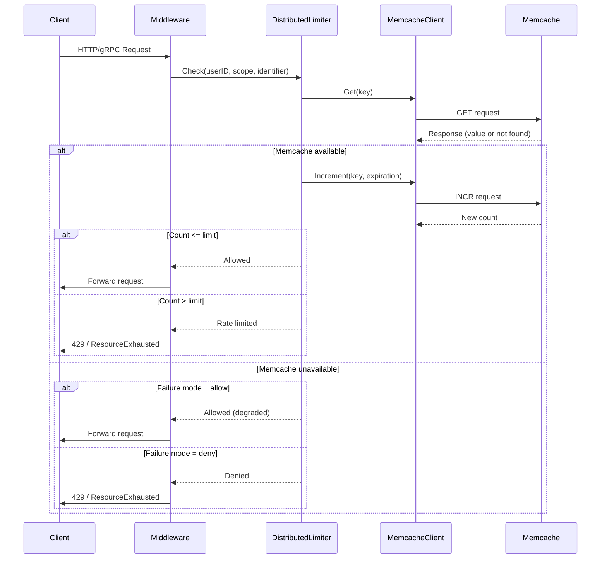

## Context

This change extends the existing in-memory rate limiting implementation to support distributed rate limiting via Memcache. The current implementation provides per-endpoint, global, HTTP-only, and gRPC-only rate limiting using the token bucket algorithm, but all state is stored in-memory per process instance.

The new implementation must:
1. Support distributed rate limiting across multiple application instances
2. Use Memcache as the shared storage for rate limit state
3. Provide configurable failure behavior when Memcache is unavailable
4. Maintain backward compatibility with existing in-memory limiters
5. Support all existing rate limiting strategies (global, per-endpoint, HTTP-only, gRPC-only)

### Constraints

- Must use `github.com/bradfitz/gomemcache` as the Memcache client
- Must support counter-based approach with atomic operations
- Must maintain backward compatibility with in-memory limiters
- Token bucket algorithm semantics should be preserved as much as possible
- Go 1.22+ language features
- Must handle Memcache failures gracefully

## Goals / Non-Goals

### Goals

- Provide distributed rate limiting via Memcache
- Implement counter-based rate limiting with atomic operations
- Support configurable failure behavior (fail-open vs fail-closed)
- Extend configuration to support Memcache settings
- Create distributed limiters for all existing strategies
- Maintain backward compatibility with in-memory limiters
- Support both environment variables and config file for Memcache configuration

### Non-Goals

- Redis support (Memcache only)
- Dynamic configuration reloading
- Metrics or monitoring integration
- Alternative distributed storage backends
- Complex distributed locking mechanisms

## Decisions

### Decision 1: Counter-Based Sliding Window Algorithm

**What**: Use a sliding window counter approach stored in Memcache instead of the token bucket algorithm for distributed rate limiting.

**Why**: The token bucket algorithm requires tracking complex state (tokens, last refill time) that is difficult to synchronize atomically across multiple instances. A sliding window counter is simpler to implement with Memcache's atomic increment/decrement operations and provides equivalent rate limiting semantics.

**Alternatives considered**:
- Full token bucket in Memcache: Too complex, requires locking or compare-and-swap operations
- Fixed window counter: Less accurate at window boundaries, can allow bursts
- Leaky bucket: Similar complexity to token bucket

### Decision 2: Memcache Key Structure

**What**: Use structured keys in Memcache with the format `rate_limit:{scope}:{user_id}:{identifier}` where scope is one of `global`, `http`, `grpc`, or `endpoint`, and identifier is the method/path for endpoint-specific limits.

**Why**: This provides clear separation between different rate limiting strategies and allows for easy debugging and inspection of Memcache state.

**Alternatives considered**:
- Single key per user: Would lose per-endpoint and per-protocol granularity
- Hashed keys: Less readable, harder to debug
- Namespace prefix: Similar to chosen approach but less flexible

### Decision 3: Configurable Failure Behavior

**What**: Add a configuration option `MEMCACHE_FAILURE_MODE` that can be set to `allow` (fail-open) or `deny` (fail-closed) to control behavior when Memcache is unavailable.

**Why**: Different use cases have different requirements. Some services prefer to continue serving traffic even if rate limiting is degraded, while others require strict rate limiting enforcement.

**Alternatives considered**:
- Always fail-open: Too permissive for strict rate limiting requirements
- Always fail-closed: Too restrictive, could cause service outages
- Fallback to in-memory: Would defeat the purpose of distributed rate limiting

### Decision 4: Separate Distributed Limiter Package

**What**: Create a new `pkg/middleware/distributed/` package for distributed limiters rather than modifying existing limiter implementations.

**Why**: This keeps the codebase clean and allows for easy switching between in-memory and distributed limiters. It also maintains backward compatibility.

**Alternatives considered**:
- Modify existing limiters: Would make code more complex, harder to test
- Single limiter with backend interface: More complex, over-engineering for current needs

### Decision 5: Memcache Client Wrapper

**What**: Create a wrapper around `github.com/bradfitz/gomemcache` to provide a cleaner API and handle common operations like atomic increments with expiration.

**Why**: The raw Memcache client API is low-level and doesn't provide all operations needed for distributed rate limiting (e.g., increment with expiration). A wrapper simplifies the implementation.

**Alternatives considered**:
- Use raw Memcache client directly: More verbose, requires duplicate code
- Use a different Memcache library: User specified to use `github.com/bradfitz/gomemcache`

### Decision 6: Time Window Expiration

**What**: Set Memcache key expiration to slightly longer than the rate limit window to handle edge cases and ensure consistent behavior.

**Why**: If keys expire exactly at the window boundary, there's a race condition where a request might be counted in both the old and new windows. A small buffer ensures smooth transitions.

**Alternatives considered**:
- No expiration: Would cause memory leaks in Memcache
- Exact window expiration: Race conditions at boundaries
- Much longer expiration: Would keep stale data for too long

## Architecture

### Distributed Rate Limiting Flow



### Key Structure

Memcache keys follow this pattern:
```
rate_limit:{scope}:{user_id}:{identifier}
```

Examples:
- Global limiter: `rate_limit:global:user123:`
- HTTP-only limiter: `rate_limit:http:user123:`
- gRPC-only limiter: `rate_limit:grpc:user123:`
- Per-endpoint limiter: `rate_limit:endpoint:user123:GET:/api/users`

### Configuration Structure

```yaml
# Example config.yaml
rate_limits:
  global:
    rate: 100
    burst: 10
  http:
    rate: 50
    burst: 5
    default_method_rate: 10
    methods:
      "GET /api/users": 20
  grpc:
    rate: 50
    burst: 5
    default_method_rate: 10
    methods:
      "/UserService/GetUser": 20

user_identification:
  http_header: "X-User-ID"
  grpc_metadata_key: "user-id"

memcache:
  servers: ["localhost:11211"]
  timeout: 100ms
  max_idle_connections: 100
  failure_mode: "allow"  # or "deny"
  key_prefix: "rate_limit"
```

## Risks / Trade-offs

### Risk 1: Memcache Performance Impact

**Risk**: Every rate-limited request requires a round-trip to Memcache, which adds latency to the request path.

**Mitigation**: Use connection pooling, configure appropriate timeouts, and document the performance impact. Consider adding local caching for frequently accessed keys in future iterations.

### Risk 2: Memcache Availability

**Risk**: If Memcache becomes unavailable, rate limiting behavior depends on the configured failure mode, which may not be acceptable for all use cases.

**Mitigation**: Provide clear documentation on failure modes and their implications. Recommend monitoring Memcache health and setting up alerts.

### Risk 3: Counter Precision

**Risk**: The sliding window counter approach may not perfectly match token bucket semantics, especially around burst handling.

**Mitigation**: Document the differences clearly. The counter approach provides equivalent rate limiting for most practical use cases.

### Risk 4: Key Expiration Edge Cases

**Risk**: Keys expiring at window boundaries can cause requests to be counted incorrectly.

**Mitigation**: Set expiration slightly longer than the window and use atomic operations to minimize race conditions.

### Trade-off: Accuracy vs Performance

**Trade-off**: The counter-based approach is simpler and faster but may not perfectly match token bucket semantics.

**Rationale**: For most rate limiting use cases, the counter-based approach provides equivalent behavior. The performance and simplicity benefits outweigh the minor semantic differences.

## Migration Plan

1. Add Memcache configuration fields to Config struct
2. Create Memcache client wrapper in new `pkg/memcache/` package
3. Implement distributed limiters in new `pkg/middleware/distributed/` package
4. Add factory function to create either in-memory or distributed limiters based on configuration
5. Update middleware to use the factory function
6. Maintain backward compatibility - in-memory limiters are used by default
7. Users can opt-in to distributed rate limiting by configuring Memcache settings

## Open Questions

- Should we support multiple Memcache servers for high availability?
- Should we add metrics for Memcache operations (latency, errors)?
- Should we support a hybrid mode with local caching for frequently accessed keys?
- What is the recommended key expiration time relative to the rate limit window?
